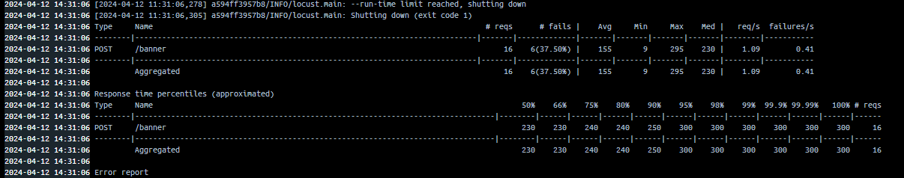

# Запуск проекта 
```shell
docker compose up --build
```

# Запуск тестов
```shell
# Так как тесты async, нужно установить pytest-asyncio
python -m pytest .\tests\banners.py
```

# Нагрузочное тестирование проведено под средством Locust 
Изначально сервис закомментирован по пути ```./docker-compose.yml```.  
### Результаты нагрузочного тестирования
